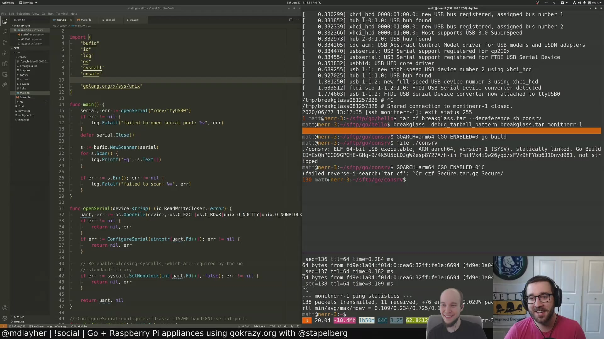
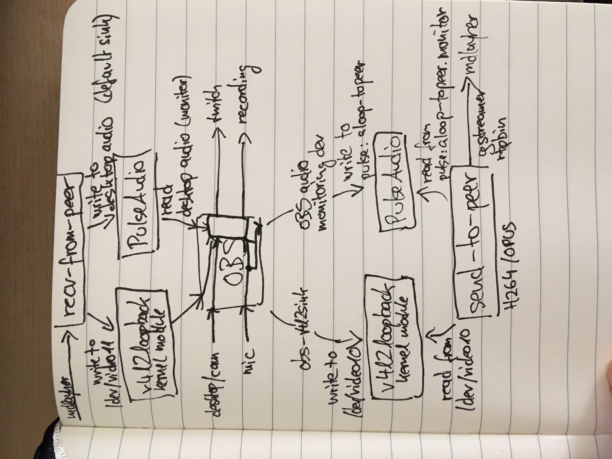

This repository contains the early beginnings of a streaming setup that is
suitable for co-streaming, pair-programming or whichever way you want to call
two people collaborating on a piece of software on a live stream.

Both people have their own twitch channels: https://www.twitch.tv/mdlayher and
https://www.twitch.tv/stapelberg. So how do we combine them?

Conceptually, we want to transport the OBS output (video and audio) to another
computer, but with low latency.

Unfortunately, the simplest solution of just using OBS to stream to a custom
RTMP server turned out to have too much latency.

## First attempt: video call + twitch multistream

In our first attempt ([recording](https://www.youtube.com/watch?v=JW8Cg6JDXSc)),
we used https://whereby.com/ for a video call with screen sharing, and
https://multistre.am/ to combine our two twitch channels, with audio only on one
channel to have it synchronized.

There were some issues with this approach:

1. Viewers of the stream without audio were confused and didn’t see the hint to
   watch at multistre.am. It would be better to have audio on both streams.

1. The OBS setup was pretty complicated: we needed to run multiple instances.

## Current attempt: gstreamer-based RTP

<a href="https://youtu.be/1g46ei9aBH0"></a>

We knew from the first attempt that WebRTC as a technology works well for low
latency streaming, but WebRTC screen sharing (as implemented in current video
conference services) had some frustration limitations: many services cap the
refresh rate at 5 fps max, and most don’t allow for full 1920x1080 resolution.

After several days of research and trial and error, we ended up using gstreamer
to establish an RTP session with multiple streams, just like WebRTC does.

This turned out to work really well ([recording](https://youtu.be/1g46ei9aBH0))!

## Overview



## Debugging

To dump a dot graph out of gstreamer, see https://developer.ridgerun.com/wiki/index.php/How_to_generate_a_Gstreamer_pipeline_diagram_(graph)

## Limitation: one person cannot see the other, only hear

There is plenty to improve about the experience, but in terms of conceptual
limitations, the big one is that the person who is driving cannot see the other
person (creating an infinite loop otherwise).

## OBS video setup

Make OBS send its video output not just to stream and recording, but also to
`/dev/video10`:

* Tools
* → v4l2sink
* → device path: `/dev/video10`
* → autostart enabled
* → click start
* → close window

## OBS audio setup

First, point OBS’s monitoring feature to the monitor device of the `snd-loop`
ALSA device, which we later grab via PulseAudio:

* File
* → Settings
* → Audio
* → Advanced
* → Monitoring device: “Monitor Of Built-In Analog Stereo”. Unfortunately, our
  custom device name is not displayed by OBS. However, monitor devices are
  listed above their corresponding device, so hopefully that helps pick the
  right entry.

Then, make OBS route your microphone into the monitoring device:

* In the mixer at the bottom of the OBS window, right-click your mic
* → Advanced Audio Properties
* → Audio Monitoring
* → Monitor and Output

## Dependencies

### Debian/Ubuntu

| package | version number |
|---------|----------------|
| [v4l2loopback-dkms](https://packages.debian.org/bullseye/v4l2loopback-dkms) | 0.12.5-1 |
| [obs-v4l2sink.deb](https://github.com/CatxFish/obs-v4l2sink/releases/download/0.1.0/obs-v4l2sink.deb) | 0.1.0 |
| [gstreamer1.0-alsa](https://packages.ubuntu.com/bionic/gstreamer1.0-alsa) | 1.14.1

### Arch Linux

| package | version number |
|---------|----------------|
| [community/v4l2loopback-dkms](https://www.archlinux.org/packages/community/any/v4l2loopback-dkms/) | 0.12.5-1 |
| [AUR:obs-v4l2sink](https://aur.archlinux.org/packages/obs-v4l2sink/) | 0.1.0 |
| [extra/gst-plugins-ugly](https://www.archlinux.org/packages/extra/x86_64/gst-plugins-ugly/) | 1.16.2-3

## Setup

To set up the V4L2 devices `/dev/video10` and `/dev/video11`, as well as the
ALSA `snd-aloop` loop device, run:

```shell
go run setup.go
```

## Sending/receiving a stream

UDP port 5000 to 5007 need to be open.

stapelberg runs:
```
# Read OBS stream video output and monitored audio output from:
#   -v4l2src_device=/dev/video10 and
#   -pulsesrc_device=alsa_output.platform-snd_aloop.0.analog-stereo.monitor
go run send-to-peer.go   -peer=rtp6.mdlayher.net.example -listen=rtp6.stapelberg.net.example

# Write remote stream video/audio to:
#   -v4l2sink_device=/dev/video11 and
#   the default PulseAudio sink (desktop audio)
go run recv-from-peer.go -peer=rtp6.mdlayher.net.example -listen=rtp6.stapelberg.net.example
```

Conversely, mdlayher runs:
```
go run send-to-peer.go   -peer=rtp6.stapelberg.net.example -listen=rtp6.mdlayher.net.example
go run recv-from-peer.go -peer=rtp6.stapelberg.net.example -listen=rtp6.mdlayher.net.example
```
